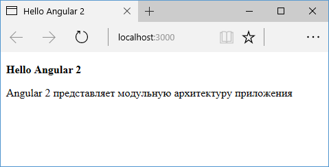

<!-- prettier-ignore-start -->
1. TOC
{:toc}

# Создание атрибутивных директив
{: .no_toc }
<!-- prettier-ignore-end -->

Атрибутивные директивы меняют поведение элемента, к которому они применяются. Например, директива `ngClass` позволяет установить для элемента класс CSS. При этом сама директива применяется к элементу в виде атрибута:

```html
<div [ngClass]="{verdanaFont:true}"></div>
```

И при необходимости мы можем сами создавать какие-то свои директивы атрибутов для каких-то определенных целей. Итак, создадим свою директиву. Добавим в папку `src/app` новый файл, который назовем `bold.directive.ts`:


Определим в файле `bold.directive.ts` следующий код:

```typescript
import { Directive, ElementRef } from '@angular/core'

@Directive({
  selector: '[bold]'
})
export class BoldDirective {
  constructor(private elementRef: ElementRef) {
    this.elementRef.nativeElement.style.fontWeight = 'bold'
  }
}
```

**Директива** - это обычный класс на TS, к которому применяется декоратор `@Directive`, соответственно нам надо импортировать эту директиву из `@angular/core`. Кроме того, здесь импортируется класс `ElementRef`. Он представляет ссылку на элемент, к которому будет применяться директива.

При применении декоратора `@Directive` необходимо определить селектор CSS, с которым будет ассоциирована директива. Селектор CSS для атрибута должен определяться в квадратных скобках. В данном случае в качестве селектора выступает `[bold]`.

Сам декоратор `@Directive` применяется к классу, который называется `BoldDirective`. Это собственно и есть класс директивы, который определяет ее логику.

Для получения элемента, к которому применяется данная директива, в классе определен конструктор, имеющий один параметр: `private elementRef: ElementRef`. Через этот параметр Angular будет передавать или инжектировать тот элемент из шаблона, в котором применяется директива.

Поскольку параметр определен с ключевым словом `private`, то для него будет создаваться одноименная приватная переменная, через которую мы можем получить объект `ElementRef` и произвести с ним какие-либо манипуляции. В частности, здесь идет обращение к вложенному свойству `nativeElement`, через которое у элемента устанавливается жирный шрифт:

```typescript
this.elementRef.nativeElement.style.fontWeight = 'bold'
```

Теперь возьмем код главного компонента и применим директиву:

```typescript
import { Component } from '@angular/core'

@Component({
  selector: 'my-app',
  template: `
    <div>
      <p bold>Hello Angular 2</p>
      <p>Angular 2 представляет модульную архитектуру приложения</p>
    </div>
  `
})
export class AppComponent {}
```

Здесь определено два параграфа, и к первому из них применяется директива. Поскольку в коде директивы был определен селектор `[bold]`, то чтобы ее применить, в коде элемента применяется данный селектор.

Но сама по себе директива не заработает. Нам еще надо ее подключить в модуле приложения - классе `AppModule`:

```typescript
import { NgModule } from '@angular/core'
import { BrowserModule } from '@angular/platform-browser'
import { AppComponent } from './app.component'
import { BoldDirective } from './bold.directive'

@NgModule({
  imports: [BrowserModule],
  declarations: [AppComponent, BoldDirective],
  bootstrap: [AppComponent]
})
export class AppModule {}
```

Как и компоненты, директивы также надо сначала импортировать из файла, где они объявлены:

```typescript
import { BoldDirective } from './bold.directive'
```

Затем она добавляется в секцию `declarations`:

```typescript
declarations: [ AppComponent, BoldDirective],
```

И если мы запустим приложение, то увидим применение директивы к первому параграфу:



Для управления стилизацией элемента выше этот элемента извлекался через объект `ElementRef` в конструкторе директивы, и у него устанавливались стилевые свойства. Однако гораздо удобнее для управления стилем использовать рендерер. Так, изменим директиву следующим образом:

```typescript
import { Directive, ElementRef, Renderer2 } from '@angular/core'

@Directive({
  selector: '[bold]'
})
export class BoldDirective {
  constructor(private elementRef: ElementRef, private renderer: Renderer2) {
    this.renderer.setStyle(this.elementRef.nativeElement, 'font-weight', 'bold')
  }
}
```

`Renderer2` представляет сервис, который также при вызове директивы автоматически передается в ее конструктор, и мы можем использовать данный сервис для стилизации элемента. А результат работы будет тот же, что и выше.

## Ссылки

- [Создание атрибутивных директив](https://metanit.com/web/angular2/3.2.php)
