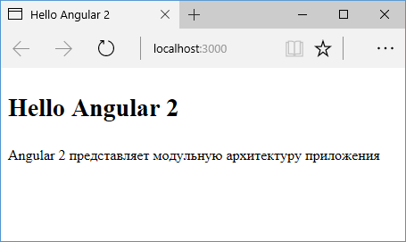

<!-- prettier-ignore-start -->
1. TOC
{:toc}

# Получение параметров в директивах
{: .no_toc }
<!-- prettier-ignore-end -->

Директива как и компонент может получать некоторые входные параметры извне. Для этого также используется декоратор `@Input`. Возьмем директиву `BoldDirective` и, допустим, мы хотим, чтобы у текста при наведении также менялась высота шрифта. Но при этом чтобы нужную высоту шрифта можно было бы задать извне директивы. Для этого изменим ее следующим образом:

```typescript
import { Directive, HostListener, Input, HostBinding, OnInit } from '@angular/core'

@Directive({
  selector: '[bold]'
})
export class BoldDirective implements OnInit {
  @Input() selectedSize = '18px'
  @Input() defaultSize = '16px'

  private fontSize: string
  private fontWeight = 'normal'
  ngOnInit() {
    this.fontSize = this.defaultSize
  }
  constructor() {}

  @HostBinding('style.fontSize') get getFontSize() {
    return this.fontSize
  }

  @HostBinding('style.fontWeight') get getFontWeight() {
    return this.fontWeight
  }

  @HostBinding('style.cursor') get getCursor() {
    return 'pointer'
  }

  @HostListener('mouseenter') onMouseEnter() {
    this.fontWeight = 'bold'
    this.fontSize = this.selectedSize
  }

  @HostListener('mouseleave') onMouseLeave() {
    this.fontWeight = 'normal'
    this.fontSize = this.defaultSize
  }
}
```

В данном случае определяются два входных параметра:

```typescript
@Input() selectedSize = "18px";
@Input() defaultSize = "16px";
```

Параметр `selectedSize` отвечает за высоту шрифта при наведении мыши, а в параметр `defaultSize` устанавливает высоту шрифта, когда указатель мыши находится вне границ элемента.

Кроме того, чтобы задействовать значение `defaultSize` при запуске приложения, реализуется метод `ngOnInit`.

Теперь задействуем эти параметры, изменив код компонента:

```typescript
import { Component } from '@angular/core'

@Component({
  selector: 'my-app',
  template: `
    <div>
      <p bold [selectedSize]="'28px'" [defaultSize]="'14px'">Hello Angular 2</p>
      <p>Angular 2 представляет модульную архитектуру приложения</p>
    </div>
  `
})
export class AppComponent {}
```

При применении директивы мы можем указать все входные параметры и их значения:

```html
<p bold [selectedSize]="'28px'" [defaultSize]="'14px'">Hello Angular 2</p>
```

При этом названия параметров заключаются в квадратные скобки, а их значения дополнительно заключаются в одинарные кавычки.

И при наведении на элемент автоматически будет меняться также и высота шрифта:



Теперь пойдем дальше и изменим первый входной параметр:

```typescript
@Input("bold") selectedSize = "18px";
```

Здесь в декоратор `@Input` передается селектор директивы - `bold`. Поэтому чтобы установить этот параметр в шаблоне компонента мы можем напрямую использовать имя директивы:

```html
<p [bold]="'28px'" [defaultSize]="'14px'">Hello Angular 2</p>
```

## Ссылки

- [Получение параметров в директивах](https://metanit.com/web/angular2/3.4.php)
