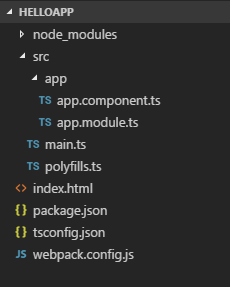
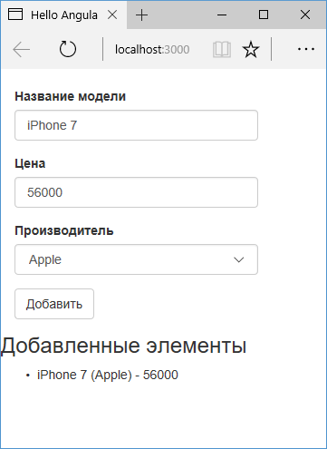

<!-- prettier-ignore-start -->
1. TOC
{:toc}

# Модуль FormsModule и директива NgModel
{: .no_toc }
<!-- prettier-ignore-end -->

Для взаимодействия с пользователем в веб-приложениях, как правило применяются формы. В Angular прежде чем использовать формы в компонентах, нам надо импортировать в главном модуле `AppModule` модуль `FormsModule`, который позволяет работать с формами:

```typescript
import { NgModule } from '@angular/core'
import { BrowserModule } from '@angular/platform-browser'
import { AppComponent } from './app.component'

import { FormsModule } from '@angular/forms'

@NgModule({
  imports: [BrowserModule, FormsModule],
  declarations: [AppComponent],
  bootstrap: [AppComponent]
})
export class AppModule {}
```

Кроме того, в файле конфигурации приложения `package.json` среди списка используемых зависимостей должен быть указан пакет `@angular/forms`:

```json
{
  "name": "helloapp",
  "version": "1.0.0",
  "description": "First Angular 7 Project",
  "author": "Eugene Popov <metanit.com>",
  "scripts": {
    "dev": "webpack-dev-server --hot --open",
    "build": "webpack"
  },
  "dependencies": {
    "@angular/forms": "~7.0.0"
    // остальные пакеты
  },
  "devDependencies": {
    // остальные пакеты
  }
}
```

При работе с формами ключевым моментом является использование директивы `NgModel`. Эта директива с помощью переданной модели создает объект `FormControl` и привязывает эту модель к созданному элементу формы. Объект `FormControl` отслеживает значение модели, а также отвечает за валидацию этого значения и взаимодействие с пользователем.

Данная директива принимает переданную ей модель в качестве входного свойства. Причем мы можем использовать как однонаправленную, так и двунаправленную привязку.

Если нам надо просто вывести значение модели в поле ввода, то можно ограничиться и однонаправленной привязкой:

```html
<input name="title" [ngModel]="title" />
```

Это обычная привязка свойства, где в качестве модели используется некоторое свойство `title`, определенное в классе компонента.

Если нам надо отслеживать изменение введенных данных, то мы можем использовать двунаправленную привязку:

```html
<input name="title" [(ngModel)]="title" />
```

Рассмотрим применение `NgModel` на примере. Возьмем проект с базовой структурой:



Определим в файле `app.component.ts` следующий компонент:

```typescript
import { Component } from '@angular/core'

export class Phone {
  constructor(public title: string, public price: number, public company: string) {}
}

@Component({
  selector: 'my-app',
  template: `
    <div class="col-xs-8">
      <div class="form-group">
        <label>Название модели</label>
        <input class="form-control" name="title" [(ngModel)]="title" />
      </div>
      <div class="form-group">
        <label>Цена</label>
        <input type="number" class="form-control" name="price" [(ngModel)]="price" />
      </div>
      <div class="form-group">
        <label>Производитель</label>
        <select class="form-control" name="company" [(ngModel)]="company">
          <option *ngFor="let comp of companies" [value]="comp">
            {{ comp }}
          </option>
        </select>
      </div>
      <div class="form-group">
        <button class="btn btn-default" (click)="addPhone(title, price, company)">Добавить</button>
      </div>
    </div>
    <div>
      <h3>Добавленные элементы</h3>
      <ul *ngFor="let p of phones">
        <li>{{ p.title }} ({{ p.company }}) - {{ p.price }}</li>
      </ul>
    </div>
  `
})
export class AppComponent {
  phones: Phone[] = []
  companies: string[] = ['Apple', 'Huawei', 'Xiaomi', 'Samsung', 'LG', 'Motorola', 'Alcatel']

  addPhone(title: string, price: number, company: string) {
    this.phones.push(new Phone(title, price, company))
  }
}
```

Для представления данных здесь определен класс `Phone`, в котором есть три свойства. Класс компонента содержит массив объектов `Phone`. С помощью метода `addPhone()` в этот массив добавляется новый объект.

Для добавления данных в шаблоне определены три поля ввода. В каждом поле определены директивы типа `[(ngModel)]="title"`. Тем самым фактически определяются некоторые значения, которые привязаны к этим полям. В обработчике нажатия кнопки вызывается метод `addPhone()`, в который передаются эти значения.

В конце шаблона добавленные данные из массива `phones` выводятся на страницу:



Все три поля привязаны к отдельным значениям, которые существуют сами по себе. Но мы можем пойти дальше и определить для формы ввода отдельную модель, которая будет инкапсулировать эти значения:

```typescript
import { Component } from '@angular/core'

export class Phone {
  constructor(public title: string, public price: number, public company: string) {}
}

@Component({
  selector: 'my-app',
  template: `
    <div class="col-xs-10">
      <div class="form-group">
        <label>Название модели</label>
        <input class="form-control" name="title" [(ngModel)]="phone.title" />
      </div>
      <div class="form-group">
        <label>Цена</label>
        <input type="number" class="form-control" name="price" [(ngModel)]="phone.price" />
      </div>
      <div class="form-group">
        <label>Производитель</label>
        <select class="form-control" name="company" [(ngModel)]="phone.company">
          <option *ngFor="let comp of companies" [value]="comp">
            {{ comp }}
          </option>
        </select>
      </div>
      <div class="form-group">
        <button class="btn btn-default" (click)="addPhone()">Добавить</button>
      </div>
    </div>
    <div>
      <h3>Добавленные элементы</h3>
      <ul *ngFor="let p of phones">
        <li>{{ p.title }} ({{ p.company }}) - {{ p.price }}</li>
      </ul>
    </div>
  `
})
export class AppComponent {
  phone: Phone = new Phone('', 0, 'Huawei')
  phones: Phone[] = []
  companies: string[] = ['Apple', 'Huawei', 'Xiaomi', 'Samsung', 'LG', 'Motorola', 'Alcatel']

  addPhone() {
    this.phones.push(new Phone(this.phone.title, this.phone.price, this.phone.company))
  }
}
```

Для полей ввода здесь создана отдельная переменная `phone`, к свойствам которой привязаны поля ввода. Стоит также обратить внимание на то, как добавляется новый объект в массив `phones` - здесь не добавляется напрямую переменная `phone`, а создается отдельный объект, который инициализируется значениями из переменной `phone`. А в остальном результат будет тем же, что и в предыдущем примере.

## Ссылки

- [Модуль FormsModule и директива NgModel](https://metanit.com/web/angular2/5.1.php)
