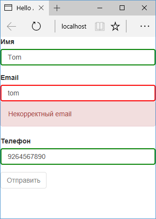
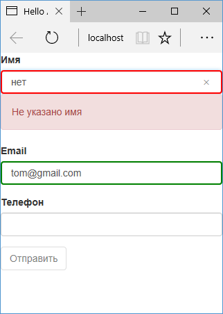
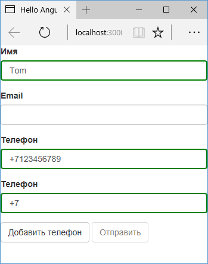

<!-- prettier-ignore-start -->
1. TOC
{:toc}

# Reactive Forms
{: .no_toc }
<!-- prettier-ignore-end -->

В прошлых темах был описан подход `Template-Driven`, который концентрировался вокруг шаблона компонента: для работы с формой и ее элементами в шаблоне компонента к элементам html применялись директивы `NgModel` и `NgForm`, правила валидации задавались в тегах элементов с помощью атрибутов `required` и `pattern`. Но есть альтернативный подход - использование реактивных форм (Reactive Forms). Рассмотрим, в чем он заключается.

При подходе Reactive Forms для формы создается набор объектов `FormGroup` и `FormControl`. Сама форма и ее подсекции представляют класс `FormGroup`, а отдельные элементы ввода - класс `FormControl`. Например, базовое создание формы:

```typescript
myForm: FormGroup = new FormGroup()
```

Добавляем в форму элементы:

```typescript
myForm: FormGroup = new FormGroup({
  userName: new FormControl(),
  userEmail: new FormControl()
})
```

Здесь определено два элемента: `userName` и `userEmail`.

Объект [FormControl](https://angular.io/api/forms/FormControl) может иметь различные формы определения. В частности, в качестве первого параметра можно передавать значение по умолчанию для элемента, а в качестве второго параметра - набор валидаторов:

```typescript
myForm: FormGroup = new FormGroup({
  userName: new FormControl('Tom', Validators.required),
  userEmail: new FormControl('', [Validators.required, Validators.pattern('[a-zA-Z_]+@[a-zA-Z_]+?.[a-zA-Z]{2,3}')])
})
```

Здесь к элементу `userEmail` применяется валидатор `Validators.required`, который требует обязательного наличия значения. Если валидаторов несколько, то они заключаются в массив. Все встроенные валидаторы можно посмотреть в [документации](https://angular.io/api/forms/Validators).

Для привязки объекта `myForm` к конкретному элементу формы применяется атрибут `formGroup`:

```html
<form [formGroup]="myForm"></form>
```

Кроме того, необходимо связать объекты `FormControl` с элементами ввода с помощью атрибута `formControlName`:

```html
<input name="name" formControlName="userName" />
```

Данный элемент будет связан с объектом `"userName": new FormControl("Tom")`.

Теперь рассмотрим, как эти объекты будут взаимодействовать с шаблоном компонента. Для этого определим следующий компонент:

```typescript
import { Component } from '@angular/core'
import { FormGroup, FormControl, Validators } from '@angular/forms'

@Component({
  selector: 'my-app',
  styles: [
    `
      input.ng-touched.ng-invalid {
        border: solid red 2px;
      }
      input.ng-touched.ng-valid {
        border: solid green 2px;
      }
    `
  ],
  template: `
    <form [formGroup]="myForm" novalidate (ngSubmit)="submit()">
      <div class="form-group">
        <label>Имя</label>
        <input class="form-control" name="name" formControlName="userName" />

        <div class="alert alert-danger" *ngIf="myForm.controls['userName'].invalid && myForm.controls['userName'].touched">
          Не указано имя
        </div>
      </div>
      <div class="form-group">
        <label>Email</label>
        <input class="form-control" name="email" formControlName="userEmail" />

        <div class="alert alert-danger" *ngIf="myForm.controls['userEmail'].invalid && myForm.controls['userEmail'].touched">
          Некорректный email
        </div>
      </div>
      <div class="form-group">
        <label>Телефон</label>
        <input class="form-control" name="phone" formControlName="userPhone" />
      </div>
      <div class="form-group">
        <button class="btn btn-default" [disabled]="myForm.invalid">
          Отправить
        </button>
      </div>
    </form>
  `
})
export class AppComponent {
  myForm: FormGroup
  constructor() {
    this.myForm = new FormGroup({
      userName: new FormControl('Tom', Validators.required),
      userEmail: new FormControl('', [Validators.required, Validators.pattern('[a-zA-Z_]+@[a-zA-Z_]+?.[a-zA-Z]{2,3}')]),
      userPhone: new FormControl()
    })
  }

  submit() {
    console.log(this.myForm)
  }
}
```

Для отображения ошибок валидации здесь используется блоки `div`, в которых определены выражения типа

```
*ngIf="myForm.controls['userName'].invalid && myForm.controls['userName'].touched">
```

С помощью выражений `myForm.controls['userName']` мы можем обратиться к нужному элементу формы и получить его состояние или значение. В данном случае если значение поля ввода невалидно, и при этом поле ввода уже получало фокус, то отображается ошибка валидации.

Но чтобы все это заработало, необходимо импортировать модуль `ReactiveFormsModule`. Для этого изменим модуль приложения `AppModule`:

```typescript
import { NgModule } from '@angular/core'
import { BrowserModule } from '@angular/platform-browser'
import { FormsModule } from '@angular/forms'
import { AppComponent } from './app.component'

import { ReactiveFormsModule } from '@angular/forms'
@NgModule({
  imports: [BrowserModule, FormsModule, ReactiveFormsModule],
  declarations: [AppComponent],
  bootstrap: [AppComponent]
})
export class AppModule {}
```



## Определение валидаторов

Кроме использования встроенных валидаторов мы также можем определять свои валидаторы. К примеру, определим в классе компонента валидатор:

```typescript
export class AppComponent {
  myForm: FormGroup
  constructor() {
    this.myForm = new FormGroup({
      userName: new FormControl('Tom', [Validators.required, this.userNameValidator]),
      userEmail: new FormControl('', [Validators.required, Validators.pattern('[a-zA-Z_]+@[a-zA-Z_]+?.[a-zA-Z]{2,3}')]),
      userPhone: new FormControl()
    })
  }
  submit() {
    console.log(this.myForm)
  }
  // валидатор
  userNameValidator(control: FormControl): { [s: string]: boolean } {
    if (control.value === 'нет') {
      return { userName: true }
    }
    return null
  }
}
```

По сути валидатор представляет обычный метод - в данном случае метод `userNameValidator`. В качестве параметра он принимает элемент формы, к которому этот валидатор применяется, а на выходе возвращает объект, где ключ - строка, а значение равно `true`.

В данном случае проверяем, если значение равно строке "нет", то возвращаем объект `{"userName": true}`. Значение `true` указывает, что элемент формы не прошел валидацию. Если же все нормально, то возвращаем `null`.

Затем этот валидатор добавляется к элементу:

```
"userName": new FormControl("Tom", [Validators.required, this.userNameValidator])
```

И в случае если в поле для ввода имени будет введено значение "нет", то данное поле не пройдет валидацию:



## Массивы элементов и FormArray

Некоторые элементы на форме могут относиться к одному и тому же признаку. Например, в анкете пользователя могут попросить указать номера телефоно, которыми он владеет. Их может быть несколько, но они будут представлять один и тот же признак - "номера телефонов". То есть логично было бы объединить все поля для ввода номеров телефонов в массив. И в Angular 2 мы легко можем реализовать подобную возможность с помощью класса `FormArray`.

Итак, изменим код компонента `AppComponent` следующим образом:

```typescript
import { Component } from '@angular/core'
import { FormGroup, FormControl, Validators, FormArray } from '@angular/forms'

@Component({
  selector: 'my-app',
  styles: [
    `
      input.ng-touched.ng-invalid {
        border: solid red 2px;
      }
      input.ng-touched.ng-valid {
        border: solid green 2px;
      }
    `
  ],
  template: `
    <form [formGroup]="myForm" novalidate (ngSubmit)="submit()">
      <div class="form-group">
        <label>Имя</label>
        <input class="form-control" name="name" formControlName="userName" />

        <div class="alert alert-danger" *ngIf="myForm.controls['userName'].invalid && myForm.controls['userName'].touched">
          Не указано имя
        </div>
      </div>
      <div class="form-group">
        <label>Email</label>
        <input class="form-control" name="email" formControlName="userEmail" />

        <div class="alert alert-danger" *ngIf="myForm.controls['userEmail'].invalid && myForm.controls['userEmail'].touched">
          Некорректный email
        </div>
      </div>
      <div formArrayName="phones">
        <div class="form-group" *ngFor="let phone of myForm.controls['phones'].controls; let i = index">
          <label>Телефон</label>
          <input class="form-control" formControlName="{{ i }}" />
        </div>
      </div>
      <div class="form-group">
        <button class="btn btn-default" (click)="addPhone()">
          Добавить телефон
        </button>
        <button class="btn btn-default" [disabled]="myForm.invalid">
          Отправить
        </button>
      </div>
    </form>
  `
})
export class AppComponent {
  myForm: FormGroup
  constructor() {
    this.myForm = new FormGroup({
      userName: new FormControl('Tom', [Validators.required]),
      userEmail: new FormControl('', [Validators.required, Validators.pattern('[a-zA-Z_]+@[a-zA-Z_]+?.[a-zA-Z]{2,3}')]),
      phones: new FormArray([new FormControl('+7', Validators.required)])
    })
  }
  addPhone() {
    ;(<FormArray>this.myForm.controls['phones']).push(new FormControl('+7', Validators.required))
  }
  submit() {
    console.log(this.myForm)
  }
}
```

Теперь поля для ввода телефонных номеров представлют массив:

```
"phones": new FormArray([
        new FormControl("+7", Validators.required)
])
```

Массив или `FormArray` хранит набор объектов `FormControl`. И в данном случае добавляется один такой объект.

Чтобы можно было динамически при необходимости добавлять новые объекты, в классе компонента предусмотрен метод `addPhone()`:

```
addPhone(){
    (<FormArray>this.myForm.controls["phones"]).push(new FormControl("+7", Validators.required));
}
```

В этой сложной конструкции мы сначала получаем объект формы через выражение `this.myForm.controls["phones"]`, затем приводим его к типу `FormArray`. И далее как и в обычный массив добавляем через метод `push` новый элемент.

В коде html предусматриваем вывод объектов на форму с помощью директивы `ngFor`:

```html
<div formArrayName="phones">
  <div class="form-group" *ngFor="let phone of myForm.controls['phones'].controls; let i = index">
    <label>Телефон</label>
    <input class="form-control" formControlName="{{i}}" />
  </div>
</div>
```

При этом контейнер всех элементов ввода имеет директиву `formArrayName="phones"`. А каждый элемент в качестве названия принимает его текущий индекс: `formControlName="{{i}}"`.

А кнопка "Добавить телефон" позволяет добавить на форму новое поле для ввода еще одного телефонного номера:



## FormBuilder

Класс `FormBuilder` представляет альтернативный подход к созданию форм:

```typescript
import { Component } from '@angular/core'
import { FormGroup, FormControl, Validators, FormArray, FormBuilder } from '@angular/forms'

@Component({
  selector: 'my-app',
  styles: [
    `
      input.ng-touched.ng-invalid {
        border: solid red 2px;
      }
      input.ng-touched.ng-valid {
        border: solid green 2px;
      }
    `
  ],
  template: `
    <form [formGroup]="myForm" novalidate (ngSubmit)="submit()">
      <div class="form-group">
        <label>Имя</label>
        <input class="form-control" name="name" formControlName="userName" />

        <div class="alert alert-danger" *ngIf="myForm.controls['userName'].invalid && myForm.controls['userName'].touched">
          Не указано имя
        </div>
      </div>
      <div class="form-group">
        <label>Email</label>
        <input class="form-control" name="email" formControlName="userEmail" />

        <div class="alert alert-danger" *ngIf="myForm.controls['userEmail'].invalid && myForm.controls['userEmail'].touched">
          Некорректный email
        </div>
      </div>
      <div formArrayName="phones">
        <div class="form-group" *ngFor="let phone of myForm.controls['phones'].controls; let i = index">
          <label>Телефон</label>
          <input class="form-control" formControlName="{{ i }}" />
        </div>
      </div>
      <div class="form-group">
        <button class="btn btn-default" (click)="addPhone()">
          Добавить телефон
        </button>
        <button class="btn btn-default" [disabled]="myForm.invalid">
          Отправить
        </button>
      </div>
    </form>
  `
})
export class AppComponent {
  myForm: FormGroup
  constructor(private formBuilder: FormBuilder) {
    this.myForm = formBuilder.group({
      userName: ['Tom', [Validators.required]],
      userEmail: ['', [Validators.required, Validators.pattern('[a-zA-Z_]+@[a-zA-Z_]+?.[a-zA-Z]{2,3}')]],
      phones: formBuilder.array([['+7', Validators.required]])
    })
  }
  addPhone() {
    ;(<FormArray>this.myForm.controls['phones']).push(new FormControl('+7', Validators.required))
  }
  submit() {
    console.log(this.myForm)
  }
}
```

`FormBuilder` передается в качестве сервиса в конструктор. С помощью метода `group()` создается объект `FormGroup`. Каждый элемент передается в форму в виде обычного массива значений:

```
"userName": ["Tom", [Validators.required]]
```

Результат работы компонента будет аналогичным предыдущему.

## Ссылки

- [Reactive Forms](https://metanit.com/web/angular2/5.5.php)
