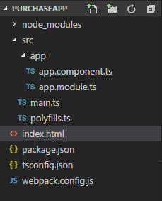
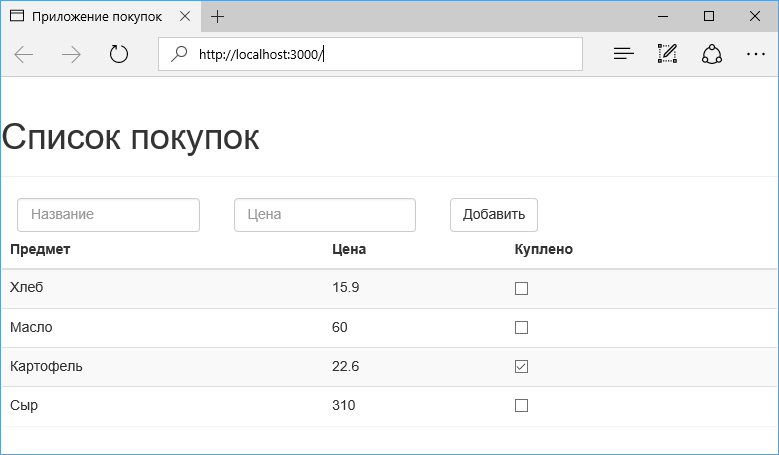

<!-- prettier-ignore-start -->
1. TOC
{:toc}

# Первое приложение на Angular
{: .no_toc }
<!-- prettier-ignore-end -->

В предыдущей теме были рассмотрены начальная информация об Angular и установка необходимых инструментов и настройка конфигурации для работы с фреймворком. Теперь же создадим первое приложение.

Для написания приложений нам потребуется обычный текстовый редактор, хотя можно использовать специальные среды программирования, как Visual Studio, Netbeans, WebStorm и другие.

Кроме того, для запуска приложения Angular потребуется веб-сервер. В качестве веб-сервера опять же можно использовать множество различных серверов - Apache, IIS, NodeJS и т.д. В данном случае мы будем опираться на NodeJS.

Итак, создадим на жестком диске папку приложения. Путь она будет называться `purchaseApp`. В этой папке создадим новый файл `package.json` со следующим содержимым:

```json
{
  "name": "helloapp",
  "version": "1.0.0",
  "description": "First Angular 7 Project",
  "author": "Eugene Popov <metanit.com>",
  "scripts": {
    "dev": "webpack-dev-server --hot --open",
    "build": "webpack"
  },
  "dependencies": {
    "@angular/common": "~7.0.0",
    "@angular/compiler": "~7.0.0",
    "@angular/core": "~7.0.0",
    "@angular/forms": "~7.0.0",
    "@angular/platform-browser": "~7.0.0",
    "@angular/platform-browser-dynamic": "~7.0.0",
    "@angular/router": "~7.0.0",
    "core-js": "^2.5.7",
    "rxjs": "^6.3.3",
    "zone.js": "^0.8.26"
  },
  "devDependencies": {
    "@types/node": "^10.12.0",
    "typescript": "^3.0.0",
    "webpack": "^4.21.0",
    "webpack-cli": "^3.1.2",
    "webpack-dev-server": "^3.1.9",
    "angular2-template-loader": "^0.6.2",
    "awesome-typescript-loader": "^5.2.1",
    "uglifyjs-webpack-plugin": "^2.0.0"
  }
}
```

Также добавим в папку проекта новый файл `tsconfig.json`:

```json
{
  "compilerOptions": {
    "target": "es5",
    "module": "es2015",
    "moduleResolution": "node",
    "sourceMap": true,
    "emitDecoratorMetadata": true,
    "experimentalDecorators": true,
    "lib": ["es2015", "dom"],
    "noImplicitAny": true,
    "suppressImplicitAnyIndexErrors": true,
    "typeRoots": ["node_modules/@types/"]
  },
  "exclude": ["node_modules"]
}
```

Как было уже описано в прошлой теме, файл `package.json` устанавливает пакеты и зависимости, которые будут использоваться проектом.

Файл `tsconfig.json` устанавливает конфигурацию для компилятора TypeScript.

Для сборки проекта будем использовать сборщик Webpack, поэтому также определим в папке проекта файл `webpack.config.js`:

```javascript
var path = require('path')
var webpack = require('webpack')
var UglifyJSPlugin = require('uglifyjs-webpack-plugin') // плагин минимизации
module.exports = {
  entry: {
    polyfills: './src/polyfills.ts',
    app: './src/main.ts'
  },
  output: {
    path: path.resolve(__dirname, './public'), // путь к каталогу выходных файлов - папка public
    publicPath: '/public/',
    filename: '[name].js' // название создаваемого файла
  },
  resolve: {
    extensions: ['.ts', '.js']
  },
  module: {
    rules: [
      //загрузчик для ts
      {
        test: /\.ts$/, // определяем тип файлов
        use: [
          {
            loader: 'awesome-typescript-loader',
            options: { configFileName: path.resolve(__dirname, 'tsconfig.json') }
          },
          'angular2-template-loader'
        ]
      }
    ]
  },
  plugins: [
    new webpack.ContextReplacementPlugin(
      /angular(\\|\/)core/,
      path.resolve(__dirname, 'src'), // каталог с исходными файлами
      {} // карта маршрутов
    ),
    new UglifyJSPlugin()
  ]
}
```

После создания этих трех файлов в папке проекта откроем командную строку (терминал) и перейдем в ней к папке проекта с помощью команды `cd`:

```
C:\WINDOWS\system32>cd C:\angular2\purchaseApp
```

И затем выполним команду `npm install`, которая установит все необходимые модули:

```
C:\angular2\purchaseApp>npm install
```

После выполнения этой команды в папке проекта должна появиться подпапка `node_modules`, которая содержит все используемые зависимости и пакеты.

Затем создадим в папке проекта каталог `src`, а в этом каталоге определим папку `app`.

В каталог `src/app` добавим новый файл, который назовем `app.component.ts` и который будет иметь следующий код:

```typescript
import { Component } from '@angular/core'

class Item {
  purchase: string
  done: boolean
  price: number

  constructor(purchase: string, price: number) {
    this.purchase = purchase
    this.price = price
    this.done = false
  }
}

@Component({
  selector: 'purchase-app',
  template: `
    <div class="page-header">
      <h1>Список покупок</h1>
    </div>
    <div class="panel">
      <div class="form-inline">
        <div class="form-group">
          <div class="col-md-8">
            <input class="form-control" [(ngModel)]="text" placeholder="Название" />
          </div>
        </div>
        <div class="form-group">
          <div class="col-md-6">
            <input type="number" class="form-control" [(ngModel)]="price" placeholder="Цена" />
          </div>
        </div>
        <div class="form-group">
          <div class="col-md-offset-2 col-md-8">
            <button class="btn btn-default" (click)="addItem(text, price)">Добавить</button>
          </div>
        </div>
      </div>
      <table class="table table-striped">
        <thead>
          <tr>
            <th>Предмет</th>
            <th>Цена</th>
            <th>Куплено</th>
          </tr>
        </thead>
        <tbody>
          <tr *ngFor="let item of items">
            <td>{{ item.purchase }}</td>
            <td>{{ item.price }}</td>
            <td><input type="checkbox" [(ngModel)]="item.done" /></td>
          </tr>
        </tbody>
      </table>
    </div>
  `
})
export class AppComponent {
  items: Item[] = [{ purchase: 'Хлеб', done: false, price: 15.9 }, { purchase: 'Масло', done: false, price: 60 }, { purchase: 'Картофель', done: true, price: 22.6 }, { purchase: 'Сыр', done: false, price: 310 }]
  addItem(text: string, price: number): void {
    if (text == null || text.trim() == '' || price == null) return
    this.items.push(new Item(text, price))
  }
}
```

Первой строкой здесь импортируется функциональность компонента из `@angular/core`.

Для работы нам потребуется вспомогательный класс `Item`. Этот класс содержит три поля: `purchase` (название покупки), `done` (сделана ли покупка) и `price` (ее цена).

В самом классе компонента определяется начальный список покупок, который будет выводиться на страницу:

```typescript
items: Item[] =
    [
        { purchase: "Хлеб", done: false, price: 15.9 },
        { purchase: "Масло", done: false, price: 60 },
        { purchase: "Картофель", done: true, price: 22.6 },
        { purchase: "Сыр", done: false, price:310 }
    ];
```

И также в классе определен метод добавления в этот список:

```typescript
addItem(text: string, price: number): void {

    if(text==null || text.trim()=="" || price==null)
        return;
    this.items.push(new Item(text, price));
}
```

Для вывода покупок здесь определен большой шаблон. Вообще подобные большие шаблоны стоит выносить в отдельные файлы, чтобы сделать код компонента проще. Но в нашем случае пусть все пока будет определено в самом компоненте.

В самом шаблоне для вывода данных из массива `items` в таблицу предусмотрена директива:

```
*ngFor="let item of items"
```

Кроме того, сверху от таблицы расположена форма для ввода нового объекта `Item`. А к нажатию кнопки привязан метод `addItem()` компонента.

Чтобы задействовать этот компонент, добавим в каталог `src/app` файл модуля `app.module.ts`:

```typescript
import { NgModule } from '@angular/core'
import { BrowserModule } from '@angular/platform-browser'
import { FormsModule } from '@angular/forms'
import { AppComponent } from './app.component'
@NgModule({
  imports: [BrowserModule, FormsModule],
  declarations: [AppComponent],
  bootstrap: [AppComponent]
})
export class AppModule {}
```

Уровнем выше в каталоге `src` определим файл `main.ts` для запуска проекта:

```typescript
import { platformBrowserDynamic } from '@angular/platform-browser-dynamic'
import { AppModule } from './app/app.module'
const platform = platformBrowserDynamic()
platform.bootstrapModule(AppModule)
```

Также в каталоге `src` определим файл `polyfills.ts`, который необходим для запуска приложения:

```typescript
import 'core-js/es6'
// для поддержки Reflect Api
import 'core-js/es7/reflect'
// zone используется angular
import 'zone.js/dist/zone'
```

В конце определим главную страницу `index.html` в корневой папке проекта:

```html
<!DOCTYPE html>
<html>
  <head>
    <meta charset="utf-8" />
    <title>Приложение покупок</title>
    <meta name="viewport" content="width=device-width, initial-scale=1" />
    <link rel="stylesheet" href="https://maxcdn.bootstrapcdn.com/bootstrap/3.3.2/css/bootstrap.min.css" />
  </head>
  <body>
    <purchase-app>Загрузка...</purchase-app>
    <script src="public/polyfills.js"></script>
    <script src="public/app.js"></script>
  </body>
</html>
```

В итоге у нас получится следующая структура проекта:



Теперь запустим проект. Для этого в командной строке (терминале) перейдем к папке проекта и затем выполним команду `npm run dev`:

```
C:\angular2\purchaseApp>npm run dev
```

После этого в веб-браузере будет отображена таблица с покупками и форма для добавлени новой покупки:



## Ссылки

- [Первое приложение на Angular](https://metanit.com/web/angular2/1.2.php)
