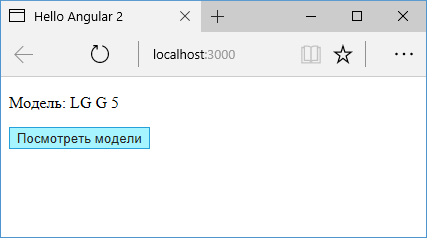
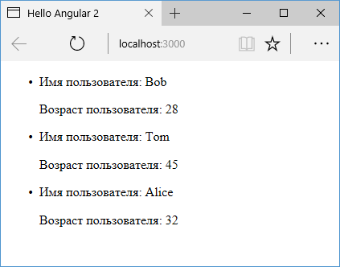

<!-- prettier-ignore-start -->
1. TOC
{:toc}

# AsyncPipe
{: .no_toc }
<!-- prettier-ignore-end -->

Одним из встроенных классов, который в отличие от других `pipes` уже по умолчанию представляет тип `impure`. `AsyncPipe` позволяет получить результат асинхронной операции.

`AsyncPipe` отслеживает объекты `Observable` и `Promise` и возвращает полученное из этих объектов значение. При получении значения `AsyncPipe` сигнализирует компоненту о том, что надо проверить изменения. Если компонент уничтожается, то `AsyncPipe` автоматически отписывается от объектов `Observable` и `Promise`, что дезавуирует возможные утечки памяти.

Используем `AsyncPipe`:

```typescript
import { Component } from '@angular/core'
import { Observable, interval } from 'rxjs'
import { map } from 'rxjs/operators'

@Component({
  selector: 'my-app',
  template: `
    <p>Модель: {{ phone | async }}</p>
    <button (click)="showPhones()">Посмотреть модели</button>
  `
})
export class AppComponent {
  phones = ['iPhone 7', 'LG G 5', 'Honor 9', 'Idol S4', 'Nexus 6P']

  phone: Observable<string>
  constructor() {
    this.showPhones()
  }

  showPhones() {
    this.phone = interval(500).pipe(map((i: number) => this.phones[i]))
  }
}
```

Здесь с периодичностью в 500 миллисекунд в шаблон компонента передается очередной элемент из массива phones.



Компонент не должен подписываться на асинхронное получение данных, обрабатывать их, а при уничтожении отписываться от получения данных. Всю эту работу делает `AsyncPipe`.

Поскольку `AsyncPipe` позволяет легко извлекать данные из результата асинхронных операций, то его очень удобно применять, например, при загрузке данных из сети. Для примера определим следующий проект:


В файле `http.service.ts` определим сервис, который получает данные с сервера:

```typescript
import { Injectable } from '@angular/core'
import { HttpClient } from '@angular/common/http'

@Injectable()
export class HttpService {
  constructor(private http: HttpClient) {}

  getUsers() {
    return this.http.get('users.json')
  }
}
```

Для хранения данных в корневой папке проекта определим файл `users.json`:

```json
[
  {
    "name": "Bob",
    "age": 28
  },
  {
    "name": "Tom",
    "age": 45
  },
  {
    "name": "Alice",
    "age": 32
  }
]
```

В файле `app.component.ts` использует сервис:

```typescript
import { Component, OnInit } from '@angular/core'
import { HttpService } from './http.service'
import { Observable } from 'rxjs'
import { User } from './user'

@Component({
  selector: 'my-app',
  template: `
    <ul>
      <li *ngFor="let user of users | async">
        <p>Имя пользователя: {{ user.name }}</p>
        <p>Возраст пользователя: {{ user.age }}</p>
      </li>
    </ul>
  `,
  providers: [HttpService]
})
export class AppComponent implements OnInit {
  users: Observable<Object>
  constructor(private httpService: HttpService) {}
  ngOnInit() {
    this.users = this.httpService.getUsers()
  }
}
```

Опять же загрузка данных запускается в методе `ngOnInit()`. В шаблоне компонента к полученным данным применяется `AsyncPipe`:

```html
<li *ngFor="let user of users | async"></li>
```

И когда данные будут получены, то они сразу будут отображены на веб-странице:



Ну чтобы загрузка данных из сети сработала, надо добавить в `AppModule` модуль `HttpClientModule`:

```typescript
import { NgModule } from '@angular/core'
import { BrowserModule } from '@angular/platform-browser'
import { AppComponent } from './app.component'

import { HttpClientModule } from '@angular/common/http'
@NgModule({
  imports: [BrowserModule, HttpClientModule],
  declarations: [AppComponent],
  bootstrap: [AppComponent]
})
export class AppModule {}
```

## Ссылки

- [AsyncPipe](https://metanit.com/web/angular2/8.4.php)
