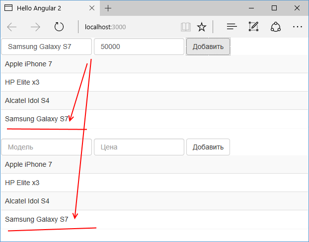

<!-- prettier-ignore-start -->
1. TOC
{:toc}

# Один сервис для всех компонентов
{: .no_toc }
<!-- prettier-ignore-end -->

Вполне возможно, что в нашем приложении будет несколько различных компонентов, которые используют сервисы. При этом компоненты могут использовать одни и те же сервисы. Например, в прошлых темах был создан сервис DataService, который управляет данными. Определим специальный компонент для работы с данными. Для этого возьмем проект из прошлой темы и добавим в папку src/app новый файл data.component.ts:


Определим в этом файле следующий код:

```typescript
import { Component, OnInit } from '@angular/core'
import { DataService } from './data.service'
import { LogService } from './log.service'
import { Phone } from './phone'

@Component({
  selector: 'data-comp',
  template: `
    <div class="panel">
      <div class="form-inline">
        <div class="form-group">
          <input class="form-control" [(ngModel)]="name" placeholder="Модель" />
          <input type="number" class="form-control" [(ngModel)]="price" placeholder="Цена" />
          <button class="btn btn-default" (click)="addItem(name, price)">Добавить</button>
        </div>
      </div>
      <table class="table table-striped">
        <tr *ngFor="let item of items">
          <td>{{ item.name }}</td>
        </tr>
      </table>
    </div>
  `,
  providers: [DataService, LogService]
})
export class DataComponent implements OnInit {
  items: Phone[] = []
  constructor(private dataService: DataService) {}

  addItem(name: string, price: number) {
    this.dataService.addData(name, price)
  }
  ngOnInit() {
    this.items = this.dataService.getData()
  }
}
```

DataComponent загружает и добавляет данные. Для работы с сервисами декоратор Component определяет секцию providers:

```typescript
providers: [DataService, LogService]
```

Используем этот компонент DataComponent в главном компоненте приложения AppComponent:

```typescript
import { Component } from '@angular/core'

@Component({
  selector: 'my-app',
  template: `
    <data-comp></data-comp> <data-comp></data-comp>
  `
})
export class AppComponent {}
```

Этот компонент через элемент data-comp вызывает компонент DataComponent. Причем вызывает два раза. То есть для обработки каждого элемента будет создаваться свой объект DataComponent.

И соответственно изменим главный модуль приложения AppModule:

```typescript
import { NgModule } from '@angular/core'
import { BrowserModule } from '@angular/platform-browser'
import { FormsModule } from '@angular/forms'
import { AppComponent } from './app.component'
import { DataComponent } from './data.component'

@NgModule({
  imports: [BrowserModule, FormsModule],
  declarations: [AppComponent, DataComponent],
  bootstrap: [AppComponent]
})
export class AppModule {}
```

Теперь запустим приложение и попробуем добавить новый элемент:


Как видно на скриншоте, при добавлении в одном компоненте новый элемент будет добавляться только для этого компонента. Потому что у нас два отдельных компонента, и для каждого из них будет создаваться свой набор сервисов DataService и LogService.

Такое поведение не всегда может быть предпочтительным. Возможно, потребуется, чтобы компоненты использовали один и тот же объект сервиса, вместо создания разных сервисов для каждого компонента. Для этого мы можем зарегистрировать все сервисы не в компоненте, а в главном модуле приложения AppModule:

```typescript
import { NgModule } from '@angular/core'
import { BrowserModule } from '@angular/platform-browser'
import { FormsModule } from '@angular/forms'
import { AppComponent } from './app.component'
import { DataComponent } from './data.component'
import { DataService } from './data.service'
import { LogService } from './log.service'
@NgModule({
  imports: [BrowserModule, FormsModule],
  declarations: [AppComponent, DataComponent],
  providers: [DataService, LogService], // регистрация сервисов
  bootstrap: [AppComponent]
})
export class AppModule {}
```

В этом случае мы уже можем убрать регистрацию сервисов из компонента DataComponent:

```typescript
import { Component, OnInit } from '@angular/core'
import { DataService } from './data.service'
import { LogService } from './log.service'
import { Phone } from './phone'

@Component({
  selector: 'data-comp',
  template: `
    <div class="panel">
      <div class="form-inline">
        <div class="form-group">
          <input class="form-control" [(ngModel)]="name" placeholder="Модель" />
          <input type="number" class="form-control" [(ngModel)]="price" placeholder="Цена" />
          <button class="btn btn-default" (click)="addItem(name, price)">Добавить</button>
        </div>
      </div>
      <table class="table table-striped">
        <tr *ngFor="let item of items">
          <td>{{ item.name }}</td>
        </tr>
      </table>
    </div>
  `
})
export class DataComponent implements OnInit {
  items: Phone[] = []
  constructor(private dataService: DataService) {}

  addItem(name: string, price: number) {
    this.dataService.addData(name, price)
  }
  ngOnInit() {
    this.items = this.dataService.getData()
  }
}
```

После этого оба объекта DataComponent будут использовать один и тот же сервис DataService. Поэтому добавление объекта в одном компоненте автоматически отразится и на другом:



## Ссылки

- [Один сервис для всех компонентов](https://metanit.com/web/angular2/4.3.php)
