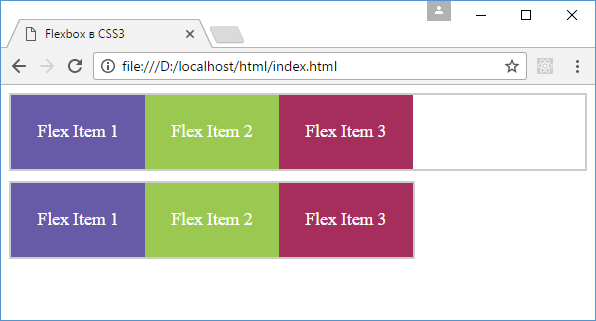

<!-- prettier-ignore-start -->
# Что такое Flexbox. Flex Container
{: .no_toc }
<!-- prettier-ignore-end -->

**Flexbox** - это общее название для модуля Flexible Box Layout, который имеется в CSS3. Данный модуль определяет особый режим компоновки/верстки пользовательского интерфейса, который называется flex layout. В этом плане Flexbox предоставляет иной подход к созданию пользовательского интерфейса, который отличается от табличной или блочной верстки. Развернутое описание стандарта по модулю можно посмотреть в [спецификации](https://www.w3.org/TR/css-flexbox-1/).

<!-- prettier-ignore -->
1. TOC
{:toc}

Благодаря Flexbox проще создавать сложные, комплексные интерфейсы, где мы с легкостью можем переопределять направление и выравнивание элементов, создавать адаптивные табличные представления. Кроме того, Flexbox довольно прост в использовании. Единственная проблема, которая может возникнуть при его применении, - это кроссбраузерность. Например, в Internet Explorer поддержка Flexbox и то частичная появилась только в последней версии - IE11. В то же время все современные браузеры, в том числе Microsoft Edge, Opera, Google Chrome, Safari, Firefox, имеют полную поддержку данного модуля.

Основными составляющими компоновки flexbox являются flex-контейнер (flex container) и flex-элементы (flex items). Flex container представляет некоторый элемент, внутри которого размещены flex-элементы.

## Основные понятия

Прежде чем переходить к изучению верстки flexbox, стоит рассмотреть некоторые основные понятия.

Одно из ключевых понятий представляет main axis или центральная ось. Это условная ось во flex-контейнере, вдоль которой позиционируются flex-элементы.


Элементы в контейнере могут располагаться по горизонтали в виде строки и по вертикали в виде столбца. В зависимости от типа расположения будет меняться и центральная ось. Если расположение в виде строки, то центральная ось направлена горизонтально слева направо. Если расположение в виде столбца, то центральная ось направлена вертикально сверху вниз.

Термины main start и main end описывают соответственно начало и конец центральной оси, а расстояние между между ними обозначается как main size.

Кроме основной оси существует также поперечная ось или cross axis. Она перпендикулярна основной. При расположении элементов в виде строки cross axis направлена сверху вниз, а при расположении в виде столбца она направлена слева направо. Начало поперечной оси обозначается как cross start, а ее конец - как cross end. Расстояние между ними описывается термином cross size.

То есть, если элементы располагаются в строку, то main size будет представлять ширину контейнера или элементов, а cross size - их высоту. Если же элементы располагаются в столбик, то, наоборот, main size представляет высоту контейнера и элементов, а cross size - их ширину.

## Создание flex-контейнера

Для создания flex-контейнера необходимо присвоить его стилевому свойству [`display`](../display.md) одно из двух значений: `flex` или `inline-flex`.

Создадим простейшую веб-страницу, которая применяет flexbox:

```html
<!DOCTYPE html>
<html>
  <head>
    <meta charset="utf-8" />
    <title>Flexbox в CSS3</title>
    <style>
      .flex-container {
        display: flex;
      }
      .flex-item {
        text-align: center;
        font-size: 1.1em;
        padding: 1.5em;
        color: white;
      }
      .color1 {
        background-color: #675ba7;
      }
      .color2 {
        background-color: #9bc850;
      }
      .color3 {
        background-color: #a62e5c;
      }
    </style>
  </head>
  <body>
    <div class="flex-container">
      <div class="flex-item color1">Flex Item 1</div>
      <div class="flex-item color2">Flex Item 2</div>
      <div class="flex-item color3">Flex Item 3</div>
    </div>
  </body>
</html>
```

Для контейнера flex-container установлено свойство `display: flex`. В нем располагается три flex-элемента.


Если значение `flex` определяет контейнер как блочный элемент, то значение `inline-flex` определяет элемент как строчный (inline). Рассмотрим оба способа на примере:

```html
<!DOCTYPE html>
<html>
  <head>
    <meta charset="utf-8" />
    <title>Flexbox в CSS3</title>
    <style>
      .flex-container {
        display: flex;
        border: 2px solid #ccc;
      }
      .inline-flex-container {
        display: inline-flex;
        border: 2px solid #ccc;
        margin-top: 10px;
      }
      .flex-item {
        text-align: center;
        font-size: 1.1em;
        padding: 1.5em;
        color: white;
      }
      .color1 {
        background-color: #675ba7;
      }
      .color2 {
        background-color: #9bc850;
      }
      .color3 {
        background-color: #a62e5c;
      }
    </style>
  </head>
  <body>
    <div class="flex-container">
      <div class="flex-item color1">Flex Item 1</div>
      <div class="flex-item color2">Flex Item 2</div>
      <div class="flex-item color3">Flex Item 3</div>
    </div>

    <div class="inline-flex-container">
      <div class="flex-item color1">Flex Item 1</div>
      <div class="flex-item color2">Flex Item 2</div>
      <div class="flex-item color3">Flex Item 3</div>
    </div>
  </body>
</html>
```



В частности, в первом случае flex-контейнер растягивается по ширине страницы, а во втором случае занимает именно столько места, сколько необходимо для flex-элементов.

## Ссылки

- [Что такое Flexbox. Flex Container](https://metanit.com/web/html5/12.1.php)
