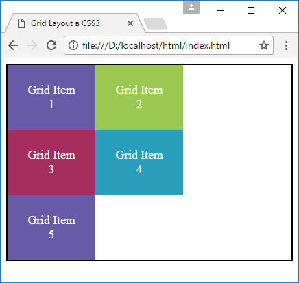
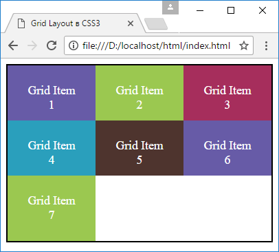

<!-- prettier-ignore-start -->
1. TOC
{:toc}

# Строки и столбцы
{: .no_toc }
<!-- prettier-ignore-end -->

Грид образует сетку из строк и столбцов, на пересечении которых образуются ячейки. И для установки строк и столбцов в Grid Layout использовать следующие свойства CSS3:

- [`grid-template-columns`](../grid-template-columns.md): настраивает столбцы
- [`grid-template-rows`](../grid-template-rows.md): настраивает строки

## Столбцы

Для определения столбцов используем у grid-контейнера стилевое свойство grid-template-columns. Например, определим грид с двумя столбцами:

```html
<!DOCTYPE html>
<html>
  <head>
    <meta charset="utf-8" />
    <meta name="viewport" content="width=device-width" />
    <title>Grid Layout в CSS3</title>
    <style>
      .grid-container {
        border: solid 2px #000;
        display: grid;
        grid-template-columns: 8em 8em;
      }

      .grid-item {
        box-sizing: border-box;
        text-align: center;
        font-size: 1.1em;
        padding: 1.5em;
        color: white;
      }

      .color1 {
        background-color: #675ba7;
      }
      .color2 {
        background-color: #9bc850;
      }
      .color3 {
        background-color: #a62e5c;
      }
      .color4 {
        background-color: #2a9fbc;
      }
    </style>
  </head>
  <body>
    <div class="grid-container">
      <div class="grid-item color1">Grid Item 1</div>
      <div class="grid-item color2">Grid Item 2</div>
      <div class="grid-item color3">Grid Item 3</div>
      <div class="grid-item color4">Grid Item 4</div>
      <div class="grid-item color1">Grid Item 5</div>
    </div>
  </body>
</html>
```

В качестве значения свойству `grid-template-columns` передается ширина столбцов. Сколько мы хотим иметь в гриде столбцов, столько и нужно передать значений этому свойству. Так, в случае выше грид содержит два столбца, поэтому свойству передаются два значения, которые указывают ширину столбцов:



Соответственно если мы хотим, чтобы в гриде было три столбца, то нам надо передать три значения, например:

```css
grid-template-columns: 8em 7em 8em;
```

Если столбцов больше чем элементов, то по умолчанию для их вмещения создаются новые строки.

## Строки

Настойка строк во многом аналогичная настройке столбцов. Для этого у грид-контейнера необходимо установить свойство `grid-template-rows`, которое задает количество и размеры строк:

```html
<!DOCTYPE html>
<html>
  <head>
    <meta charset="utf-8" />
    <meta name="viewport" content="width=device-width" />
    <title>Grid Layout в CSS3</title>
    <style>
      .grid-container {
        border: solid 2px #000;
        display: grid;
        grid-template-rows: 4em 5em;
      }
      .grid-item {
        text-align: center;
        font-size: 1.1em;
        padding: 1.5em;
        color: white;
      }
      .color1 {
        background-color: #675ba7;
      }
      .color2 {
        background-color: #9bc850;
      }
      .color3 {
        background-color: #a62e5c;
      }
      .color4 {
        background-color: #2a9fbc;
      }
    </style>
  </head>
  <body>
    <div class="grid-container">
      <div class="grid-item color1">Grid Item 1</div>
      <div class="grid-item color2">Grid Item 2</div>
      <div class="grid-item color3">Grid Item 3</div>
      <div class="grid-item color4">Grid Item 4</div>
      <div class="grid-item color1">Grid Item 5</div>
      <div class="grid-item color4">Grid Item 6</div>
      <div class="grid-item color3">Grid Item 7</div>
    </div>
  </body>
</html>
```

Свойству `grid-template-rows` передается высота каждой из строк. Так, в данном случае высота первой строки составляет `4em`, а второй - `5em`.



В то же время, если элементов больше, чем ячеек грида, то образуются дополнительные строки (как в случае со столбцами). Поэтому, несмотря на то, что выше были определены настройки только для двух строк, в реальности строк в гриде будет три строки, причем, как видно на скриншоте, высота третьей строки необязательно будет 5em, как у других строк, она будет вычисляться автоматически.

Изменим стили grid-контейнера, добавив еще две строки:

```css
.grid-container {
  border: solid 2px #000;
  display: grid;
  grid-template-columns: 8em 8em 8em;
  grid-template-rows: 5em 5em 5em 5em;
}
```

Здесь определено три столбца и четыре строки:


И поскольку ячеек грида больше, чем элементов, то последняя строка оказывается пустой.

## Ссылки

- [Строки и столбцы](https://metanit.com/web/html5/13.2.php)
