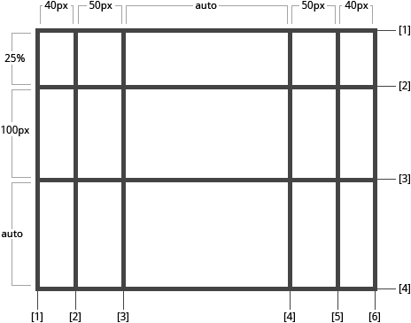

<!-- prettier-ignore-start -->
# grid-template-rows
{: .no_toc }
<!-- prettier-ignore-end -->

Свойство **`grid-template-rows`** определяет строки сетки с помощью списка значений разделённого пробелами. Значения представляют из себя размер трека, а пробелы между ними представляют линии сетки.

<!-- prettier-ignore -->
1. TOC
{:toc}

## Синтаксис

```css
/* Keyword value */
grid-template-rows: none;

/* <track-list> values */
grid-template-rows: 100px 1fr;
grid-template-rows: [linename] 100px;
grid-template-rows: [linename1] 100px [linename2 linename3];
grid-template-rows: minmax(100px, 1fr);
grid-template-rows: fit-content(40%);
grid-template-rows: repeat(3, 200px);

/* <auto-track-list> values */
grid-template-rows: 200px repeat(auto-fill, 100px) 300px;
grid-template-rows:
  minmax(100px, max-content)
  repeat(auto-fill, 200px) 20%;
grid-template-rows:
  [linename1] 100px [linename2]
  repeat(auto-fit, [linename3 linename4] 300px)
  100px;
grid-template-rows:
  [linename1 linename2] 100px
  repeat(auto-fit, [linename1] 300px) [linename3];

/* Global values */
grid-template-rows: inherit;
grid-template-rows: initial;
grid-template-rows: unset;
```

## Значения

Значение по-умолчанию: `none`

Наследуется:

Применяется к:

Анимируется:

- `<track-size>` — может быть фиксированным размером, процентами или частью свободного пространства в сетке (определяется с помощью единицы `fr` (fraction));
- `<line-name>` — произвольное имя на ваш выбор;

## Спецификации

- [CSS Grid Layout](https://drafts.csswg.org/css-grid/#propdef-grid-template-columns)

## Поддержка браузерами

<p class="ciu_embed" data-feature="css-grid" data-periods="future_1,current,past_1,past_2">
  <a href="http://caniuse.com/#feat=css-grid">Can I Use css-grid?</a> Data on support for the css-grid feature across the major browsers from caniuse.com.
</p>

## Описание и примеры

Когда вы оставляете пустое пространство между значениями треков, линиям сетки автоматически присваиваются числовые имена:

```css
.container {
  grid-template-columns: 40px 50px auto 50px 40px;
  grid-template-rows: 25% 100px auto;
}
```



Но вы можете называть линии явно. Обратите внимание на синтаксис для их названия:

```css
.container {
  grid-template-columns: [first] 40px [line2] 50px [line3] auto [col4-start] 50px [five] 40px [end];
  grid-template-rows: [row1-start] 25% [row1-end] 100px [third-line] auto [last-line];
}
```


Обратите внимание на то что у линии может быть несколько названий. Например, здесь у второй линии будет два названия: `row1-end` и `row2-start`:

```css
.container {
  grid-template-rows: [row1-start] 25% [row1-end row2-start] 25% [row2-end];
}
```

Если в вашем определении содержатся повторяющиеся части, то можно использовать нотацию `repeat()`:

```css
.container {
  grid-template-columns: repeat(3, 20px [col-start]) 5%;
}
```

Тоже самое что и:

```css
.container {
  grid-template-columns: 20px [col-start] 20px [col-start] 20px [col-start] 5%;
}
```

Единица `fr` позволяет вам настраивать размер треков как часть свободного пространства в контейнере. Вот пример, который устанавливает каждому элементу одну третью ширины контейнера.

```css
.container {
  grid-template-columns: 1fr 1fr 1fr;
}
```

Свободное пространство высчитывается после вычисления всех фиксированных элементов. В этом примере, общее количество свободного пространства для единиц `fr` не будет включать в себя 50px.

```css
.container {
  grid-template-columns: 1fr 50px 1fr 1fr;
}
```
